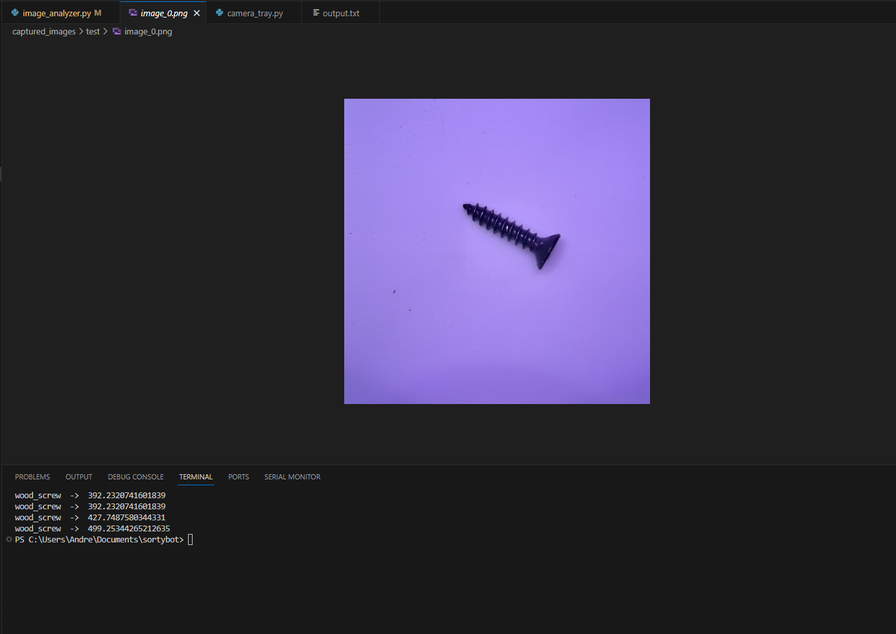

# KNN for Classification of hardware

This is a proof of concept for a device that sorts hardware using a camera and a knn learning algorithm. The results are positive so far, and the dataset and testing will be expanded. This will eventually be run on an embedded device so does not use commonly used python packages for machine learning applications.

## Demo

